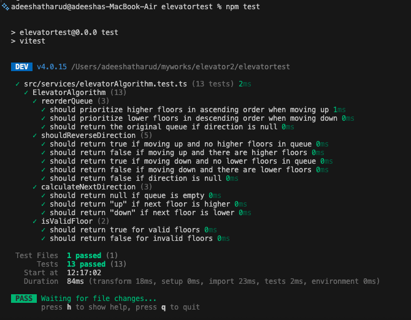

# PeerCore Elevator Test

Live demo: https://shiny-cascaron-fa587c.netlify.app/

A small elevator simulator written in TypeScript + React + Redux, designed as a demo of elevator scheduling logic and UI/UX for requesting floors. The project demonstrates a clean separation between pure business logic (elevator scheduling), application state (Redux slice), and UI (React components).

## Overview

This repository contains an elevator simulator which:
- Accepts floor requests (call buttons and control panel),
- Uses an algorithm (SCAN-like) to order and serve requests,
- Simulates elevator movement and stop durations,
- Demonstrates a small React + Redux application with TypeScript.

The algorithm and core scheduling logic are implemented in a pure module to make it easy to test and reuse.

---

## Features

- Floor call buttons (up/down) and a control panel for inside elevator requests
- A simple elevator scheduling algorithm (reorders requests according to direction)
- Movement simulation (time-based stepping & stop durations)
- Clean TypeScript types and separated services for core logic

---

## Tech stack

- TypeScript
- React (with functional components and hooks)
- Redux Toolkit
- Vite (bundler / dev server)
- Vitest (testing)
- Tailwind CSS (styling)
- Lucide icons

## ✔️ Test Suite Results

The project includes a fully unit-tested elevator scheduling algorithm written in TypeScript using Vitest.

Below is a screenshot of all tests passing:

